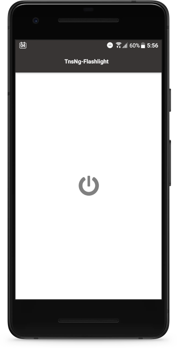

# TnsNg-Flashlight

My first mobile app project built with NativeScript and Angular

## Features

* To switch on the LED light on your phone and use it as a flash light
* Simple, clean looking and minimalistic UI
* Cross-platform, native on both iOS and Android

## Screenshots

## Tech

* Angular 8.2
* NativeScript 6.5
* nativescript-flashlight 2.0.1

## Background

As a software developer myself mainly focusing on web development, apart from web app I always want to write a mobile app. Nowadays people do not neccessarily have to own a computer, but they certainly have a phone in their hands pretty much all the time. With all the techs lying around for building mobile apps like Xamain, React Native, Ionic and NativeScript, it has never been easier to start developing a mobile app. As I use Angular everyday at work, NativeScript seems like a sensible choice for me to get start with. So here is my first mobile app project, a very simple one to get a hands on experience for the basics such as set up and config, layouts and components, build and publishing. Hopefully my next mobile app will be a more practical one.